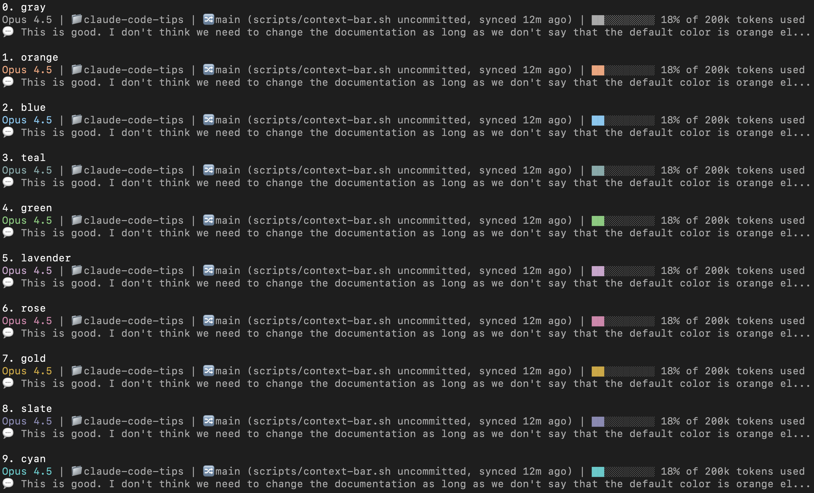
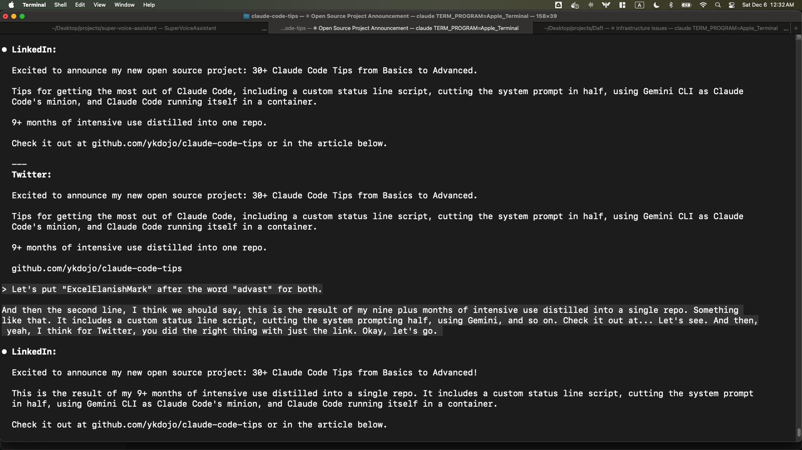
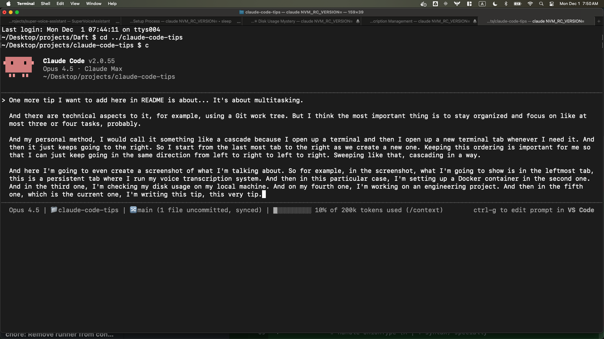
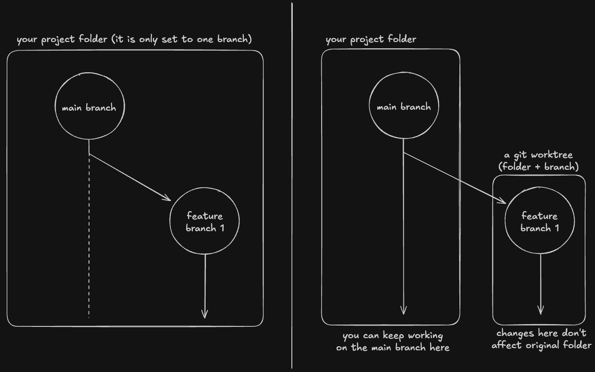
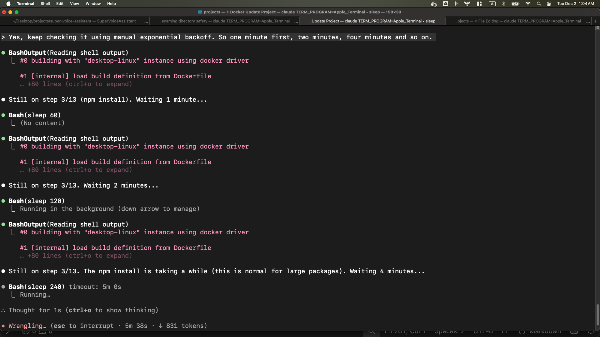

# 45가지 Claude Code 팁: 기초부터 고급까지

Claude Code를 최대한 활용하기 위한 팁 모음입니다. 커스텀 상태 표시줄 스크립트, 시스템 프롬프트를 절반으로 줄이는 방법, Gemini CLI를 Claude Code의 보조 도구로 활용하는 법, 컨테이너에서 Claude Code를 실행하는 방법 등을 포함합니다. 또한 [dx 플러그인](#팁-44-dx-플러그인-설치)도 포함되어 있습니다.

📺 [빠른 데모](https://www.youtube.com/watch?v=hiISl558JGE) - 멀티 Claude 워크플로우와 음성 입력을 포함한 팁들을 직접 확인해보세요:

[](https://www.youtube.com/watch?v=hiISl558JGE)

<!-- TOC -->
## 목차

- [팁 0: 상태 표시줄 커스터마이징](#팁-0-상태-표시줄-커스터마이징)
- [팁 1: 필수 슬래시 명령어 익히기](#팁-1-필수-슬래시-명령어-익히기)
- [팁 2: 음성으로 Claude Code와 대화하기](#팁-2-음성으로-claude-code와-대화하기)
- [팁 3: 큰 문제를 작은 문제로 분해하기](#팁-3-큰-문제를-작은-문제로-분해하기)
- [팁 4: Git과 GitHub CLI를 프로처럼 활용하기](#팁-4-git과-github-cli를-프로처럼-활용하기)
- [팁 5: AI 컨텍스트는 우유와 같다 - 신선하고 간결할수록 좋다!](#팁-5-ai-컨텍스트는-우유와-같다---신선하고-간결할수록-좋다)
- [팁 6: 터미널 출력 내보내기](#팁-6-터미널-출력-내보내기)
- [팁 7: 빠른 접근을 위한 터미널 별칭 설정하기](#팁-7-빠른-접근을-위한-터미널-별칭-설정하기)
- [팁 8: 컨텍스트를 선제적으로 압축하기](#팁-8-컨텍스트를-선제적으로-압축하기)
- [팁 9: 자율 작업을 위한 쓰기-테스트 사이클 완성하기](#팁-9-자율-작업을-위한-쓰기-테스트-사이클-완성하기)
- [팁 10: Cmd+A와 Ctrl+A는 당신의 친구](#팁-10-cmda와-ctrla는-당신의-친구)
- [팁 11: 차단된 사이트 우회를 위한 Gemini CLI 활용](#팁-11-차단된-사이트-우회를-위한-gemini-cli-활용)
- [팁 12: 자신만의 워크플로우에 투자하기](#팁-12-자신만의-워크플로우에-투자하기)
- [팁 13: 대화 기록 검색하기](#팁-13-대화-기록-검색하기)
- [팁 14: 터미널 탭으로 멀티태스킹하기](#팁-14-터미널-탭으로-멀티태스킹하기)
- [팁 15: 시스템 프롬프트 경량화하기](#팁-15-시스템-프롬프트-경량화하기)
- [팁 16: 병렬 브랜치 작업을 위한 Git 워크트리](#팁-16-병렬-브랜치-작업을-위한-git-워크트리)
- [팁 17: 장시간 작업을 위한 수동 지수 백오프](#팁-17-장시간-작업을-위한-수동-지수-백오프)
- [팁 18: 글쓰기 도우미로서의 Claude Code](#팁-18-글쓰기-도우미로서의-claude-code)
- [팁 19: 마크다운은 최고다](#팁-19-마크다운은-최고다)
- [팁 20: 링크 보존을 위해 Notion 활용하기](#팁-20-링크-보존을-위해-notion-활용하기)
- [팁 21: 장시간 위험 작업을 위한 컨테이너 활용](#팁-21-장시간-위험-작업을-위한-컨테이너-활용)
- [팁 22: Claude Code를 더 잘 쓰는 가장 좋은 방법은 계속 사용하는 것](#팁-22-claude-code를-더-잘-쓰는-가장-좋은-방법은-계속-사용하는-것)
- [팁 23: 대화 복사/포크 및 반만 복사하기](#팁-23-대화-복사포크-및-반만-복사하기)
- [팁 24: 절대 경로를 얻기 위해 realpath 사용하기](#팁-24-절대-경로를-얻기-위해-realpath-사용하기)
- [팁 25: CLAUDE.md vs 스킬 vs 슬래시 명령어 vs 플러그인 이해하기](#팁-25-claudemd-vs-스킬-vs-슬래시-명령어-vs-플러그인-이해하기)
- [팁 26: 인터랙티브 PR 리뷰](#팁-26-인터랙티브-pr-리뷰)
- [팁 27: 리서치 도구로서의 Claude Code](#팁-27-리서치-도구로서의-claude-code)
- [팁 28: 출력물 검증 방법 마스터하기](#팁-28-출력물-검증-방법-마스터하기)
- [팁 29: DevOps 엔지니어로서의 Claude Code](#팁-29-devops-엔지니어로서의-claude-code)
- [팁 30: CLAUDE.md를 단순하게 유지하고 주기적으로 검토하기](#팁-30-claudemd를-단순하게-유지하고-주기적으로-검토하기)
- [팁 31: 범용 인터페이스로서의 Claude Code](#팁-31-범용-인터페이스로서의-claude-code)
- [팁 32: 적절한 추상화 수준 선택이 핵심이다](#팁-32-적절한-추상화-수준-선택이-핵심이다)
- [팁 33: 승인된 명령어 감사하기](#팁-33-승인된-명령어-감사하기)
- [팁 34: 테스트를 많이 작성하기 (TDD 활용)](#팁-34-테스트를-많이-작성하기-tdd-활용)
- [팁 35: 미지의 영역에서 더 대담하게 - 반복적 문제 해결](#팁-35-미지의-영역에서-더-대담하게---반복적-문제-해결)
- [팁 36: 백그라운드에서 bash 명령어와 서브에이전트 실행하기](#팁-36-백그라운드에서-bash-명령어와-서브에이전트-실행하기)
- [팁 37: 개인화 소프트웨어의 시대가 왔다](#팁-37-개인화-소프트웨어의-시대가-왔다)
- [팁 38: 입력창 탐색 및 편집하기](#팁-38-입력창-탐색-및-편집하기)
- [팁 39: 계획에 시간을 투자하되, 빠르게 프로토타입 만들기](#팁-39-계획에-시간을-투자하되-빠르게-프로토타입-만들기)
- [팁 40: 과도하게 복잡한 코드 단순화하기](#팁-40-과도하게-복잡한-코드-단순화하기)
- [팁 41: 자동화의 자동화](#팁-41-자동화의-자동화)
- [팁 42: 지식을 공유하고 가능한 곳에 기여하기](#팁-42-지식을-공유하고-가능한-곳에-기여하기)
- [팁 43: 계속 배우세요!](#팁-43-계속-배우세요)
- [팁 44: dx 플러그인 설치](#팁-44-dx-플러그인-설치)
- [팁 45: 빠른 설정 스크립트](#팁-45-빠른-설정-스크립트)

<!-- /TOC -->

## 팁 0: 상태 표시줄 커스터마이징

Claude Code 하단의 상태 표시줄을 유용한 정보를 표시하도록 커스터마이징할 수 있습니다. 저는 모델명, 현재 디렉토리, git 브랜치(있는 경우), 미커밋 파일 수, origin과의 동기화 상태, 토큰 사용량 시각적 프로그레스 바를 표시하도록 설정했습니다. 또한 마지막 메시지를 보여주는 두 번째 줄도 있어서 어떤 대화를 하고 있었는지 확인할 수 있습니다:

```
Opus 4.5 | 📁claude-code-tips | 🔀main (scripts/context-bar.sh uncommitted, synced 12m ago) | ██░░░░░░░░ 18% of 200k tokens
💬 This is good. I don't think we need to change the documentation as long as we don't say that the default color is orange el...
```

컨텍스트 사용량을 확인하고 무엇을 작업하고 있었는지 기억하는 데 특히 유용합니다. 이 스크립트는 10가지 색상 테마(orange, blue, teal, green, lavender, rose, gold, slate, cyan, gray)도 지원합니다.



설정하려면 [이 샘플 스크립트](scripts/context-bar.sh)를 사용하고 [설정 안내](scripts/README.md)를 확인하세요.

## 팁 1: 필수 슬래시 명령어 익히기

내장된 슬래시 명령어들이 많습니다(`/`를 입력하면 전체 목록을 볼 수 있습니다). 알아두면 유용한 몇 가지를 소개합니다:

### /usage

속도 제한을 확인합니다:

```
 Current session
 █████████▌                                         19% used
 Resets 12:59am (America/Vancouver)

 Current week (all models)
 █████████████████████▌                             43% used
 Resets Feb 3 at 1:59pm (America/Vancouver)

 Current week (Sonnet only)
 ███████████████████▌                               39% used
 Resets 8:59am (America/Vancouver)
```

사용량을 면밀히 모니터링하고 싶다면, 탭에 열어두고 Tab 다음 Shift+Tab 또는 ← 다음 →를 사용해서 새로고침하세요.

### /chrome

Claude의 네이티브 브라우저 통합을 토글합니다:

```
> /chrome
Chrome integration enabled
```

### /mcp

MCP(Model Context Protocol) 서버를 관리합니다:

```
 Manage MCP servers
 1 server

 ❯ 1. playwright  ✔ connected · Enter to view details

 MCP Config locations (by scope):
  • User config (available in all your projects):
    • /Users/yk/.claude.json
```

### /stats

GitHub 스타일의 활동 그래프로 사용 통계를 확인합니다:

```
      Feb Mar Apr May Jun Jul Aug Sep Oct Nov Dec Jan
      ··········································▒█░▓░█░▓▒▒
  Mon ·········································▒▒██▓░█▓█░█
      ·········································░▒█▒▓░█▒█▒█
  Wed ········································░▓▒█▓▓░▒▓▒██
      ········································░▓░█▓▓▓▓█░▒█
  Fri ········································▒░░▓▒▒█▓▓▓█
      ········································▒▒░▓░░▓▒▒░░

      Less ░ ▒ ▓ █ More

  Favorite model: Opus 4.5        Total tokens: 17.6m

  Sessions: 4.1k                  Longest session: 20h 40m 45s
  Active days: 79/80              Longest streak: 75 days
  Most active day: Jan 26         Current streak: 74 days

  You've used ~24x more tokens than War and Peace
```

### /clear

대화를 지우고 새로 시작합니다.

## 팁 2: 음성으로 Claude Code와 대화하기

음성으로 대화하면 손으로 타이핑하는 것보다 훨씬 빠르게 소통할 수 있습니다. 로컬 머신에 음성 텍스트 변환 시스템을 설치하면 매우 유용합니다.

Mac에서 시도해본 옵션들:
- [superwhisper](https://superwhisper.com/)
- [MacWhisper](https://goodsnooze.gumroad.com/l/macwhisper)
- [Super Voice Assistant](https://github.com/ykdojo/super-voice-assistant) (오픈 소스, Parakeet v2/v3 지원)

호스팅 서비스를 사용하면 더 높은 정확도를 얻을 수 있지만, 로컬 모델도 이 목적에는 충분히 강력합니다. 음성 인식에 오류나 오타가 있더라도 Claude는 무엇을 말하려는지 충분히 이해합니다. 가끔 특정 단어를 더 명확하게 말해야 할 때도 있지만, 전반적으로 로컬 모델도 충분히 잘 작동합니다.

예를 들어, 아래 스크린샷에서 "ExcelElanishMark"나 "advast"처럼 잘못 인식된 단어들을 Claude가 "exclamation mark"와 "Advanced"로 올바르게 해석한 것을 볼 수 있습니다:



친구와 대화하는 것처럼 생각하면 이해하기 쉽습니다. 물론 문자나 이메일로도 소통할 수 있죠. 대부분의 사람들이 Claude Code를 그렇게 사용하는 것 같습니다. 하지만 더 빠르게 소통하고 싶다면, 왜 음성 메시지를 보내지 않겠습니까? Claude Code와 실제로 전화 통화를 할 필요는 없습니다. 그냥 음성 메시지를 보내면 됩니다. 특히 오랫동안 말하는 기술을 연습해온 저 같은 사람에게는 타이핑보다 빠릅니다.

다른 사람이 있는 방에서는 어떻게 하냐는 질문을 자주 받습니다. 저는 이어폰으로 속삭입니다 - 개인적으로 Apple EarPods(AirPods 아님)를 좋아합니다. 저렴하고 품질도 충분하며, 마이크에 가까이 대고 조용히 속삭이면 됩니다. 다른 사람들 앞에서도 잘 작동합니다. 사무실에서는 어차피 다들 말을 하니, 동료들과 대화하는 대신 음성 텍스트 변환 시스템에 조용히 말하는 것입니다. 심지어 비행기에서도 잘 됩니다. 주변 소음이 있어서 다른 사람들에게는 들리지 않지만, 마이크에 가까이 말하면 로컬 모델이 충분히 이해합니다. (사실 이 단락을 비행기에서 그 방법으로 작성하고 있습니다.)

**업데이트:** Claude Code에 이제 [내장 음성 모드](https://x.com/bcherny/status/2032238378389840018)가 있습니다. 테스트해보니 잘 작동하지만, 저는 여전히 로컬 모델이 더 빠르다고 느껴서 사용하고 있습니다.

## 팁 3: 큰 문제를 작은 문제로 분해하기

이것은 마스터해야 할 가장 중요한 개념 중 하나입니다. 전통적인 소프트웨어 엔지니어링과 정확히 동일한 원칙입니다 - 최고의 소프트웨어 엔지니어들은 이미 이것을 잘 알고 있으며, Claude Code에도 똑같이 적용됩니다.

Claude Code가 어렵거나 복잡한 문제나 코딩 작업을 한 번에 해결하지 못한다면, 여러 개의 작은 문제로 분해해달라고 요청하세요. 개별 부분을 해결할 수 있는지 확인하고, 아직도 너무 어렵다면 더 작은 하위 문제를 해결할 수 있는지 확인하세요. 모든 것이 해결 가능해질 때까지 계속하세요.

기본적으로 A에서 B로 바로 가는 대신:


A에서 A1, A2, A3를 거쳐 B로 갈 수 있습니다:


좋은 예시로, 제가 직접 음성 텍스트 변환 시스템을 만들 때가 있었습니다. 사용자가 모델을 선택하고 다운로드하고, 키보드 단축키를 사용하고, 음성 텍스트 변환을 시작하고, 변환된 텍스트를 커서 위치에 넣는 시스템이 필요했는데, 이 모든 것을 멋진 UI로 감싸야 했습니다. 그래서 작은 작업들로 분해했습니다. 먼저 모델을 다운로드하는 실행 파일만 만들었습니다. 그 다음 음성만 녹음하는 것을. 그 다음 미리 녹음된 오디오만 텍스트로 변환하는 것을. 이렇게 하나씩 완성한 후 마지막에 합쳤습니다.

이와 매우 관련이 있는 것은: 문제 해결 능력과 소프트웨어 엔지니어링 기술은 에이전트 코딩과 Claude Code의 세계에서도 여전히 매우 중요합니다. 혼자서도 많은 문제를 해결할 수 있지만, 일반적인 문제 해결 및 소프트웨어 엔지니어링 기술을 적용하면 훨씬 강력해집니다.

## 팁 4: Git과 GitHub CLI를 프로처럼 활용하기

Claude에게 Git과 GitHub CLI 작업을 처리하도록 요청하세요. 여기에는 커밋(커밋 메시지를 직접 작성하지 않아도 됨), 브랜칭, 풀링, 푸싱이 포함됩니다.

저는 개인적으로 풀은 자동으로 허용하지만 푸시는 그렇지 않습니다. 풀은 origin을 오염시키지 않지만 푸시는 문제가 생기면 더 위험하기 때문입니다.

GitHub CLI(`gh`)에서는 많은 것을 할 수 있습니다. Claude Code를 사용한 후부터 더 많이 하게 된 것 중 하나는 드래프트 PR 생성입니다. 이를 통해 Claude Code가 낮은 위험으로 PR 생성 과정을 처리할 수 있습니다 - 리뷰 준비가 되기 전에 모든 것을 검토할 수 있습니다.

그리고 `gh`는 꽤 강력합니다. 임의의 GraphQL 쿼리를 통해 전송할 수도 있습니다. 예를 들어, GitHub PR 설명이 편집된 정확한 시간도 찾을 수 있습니다:

```
⏺ Bash(gh api graphql -f query='
      query {
        repository(owner: "...", name: "...") {
          pullRequest(number: ...) {
            userContentEdits(first: 100) {
              nodes { editedAt editor { login } }
            }
          }
        }
      }')

⏺ PR 설명의 전체 편집 기록입니다:

  | #  | Edited At (UTC)     | Editor |
  |----|---------------------|--------|
  | 1  | 2025-12-01 00:08:34 | ykdojo |
  | 2  | 2025-12-01 15:57:21 | ykdojo |
  ...
```

### 커밋/PR 기여자 표시 비활성화

기본적으로 Claude Code는 커밋에 `Co-Authored-By` 트레일러를, PR에 기여자 정보를 추가합니다. `~/.claude/settings.json`에 다음을 추가하면 둘 다 비활성화할 수 있습니다:

```json
{
  "attribution": {
    "commit": "",
    "pr": ""
  }
}
```

둘 다 빈 문자열로 설정하면 기여자 표시가 완전히 제거됩니다. 이것은 이제 더 이상 사용되지 않는 `includeCoAuthoredBy` 설정을 대체합니다.

## 팁 5: AI 컨텍스트는 우유와 같다 - 신선하고 간결할수록 좋다!

Claude Code와 새 대화를 시작하면 이전 컨텍스트의 복잡성을 처리할 필요가 없기 때문에 최상의 성능을 발휘합니다. 그러나 대화가 길어질수록 컨텍스트가 길어지고 성능이 저하되는 경향이 있습니다.

따라서 새로운 주제마다 또는 성능이 저하되기 시작하면 새 대화를 시작하는 것이 좋습니다.

## 팁 6: 터미널 출력 내보내기

때로는 Claude Code의 출력을 복사해서 붙여넣기하고 싶지만, 터미널에서 직접 복사하면 항상 깔끔하지 않을 수 있습니다. 더 쉽게 콘텐츠를 가져오는 몇 가지 방법이 있습니다:

- **`/copy` 명령어**: 가장 간단한 옵션 - `/copy`를 입력하면 Claude의 마지막 응답을 마크다운으로 클립보드에 복사합니다
- **클립보드 직접 사용**: Mac이나 Linux에서는 Claude에게 `pbcopy`를 사용해서 출력을 클립보드로 바로 보내달라고 요청하세요
- **파일에 저장**: Claude가 파일에 내용을 저장한 후 VS Code(또는 즐겨 쓰는 편집기)에서 열도록 요청하세요. 줄 번호도 지정할 수 있으므로 방금 편집한 특정 줄을 열도록 요청할 수 있습니다. 마크다운 파일의 경우 VS Code에서 열면 Cmd+Shift+P(Linux/Windows의 경우 Ctrl+Shift+P)를 사용해 "Markdown: Open Preview"를 선택하면 렌더링된 버전을 볼 수 있습니다
- **URL 열기**: 직접 확인하고 싶은 URL이 있다면 Claude에게 브라우저에서 열도록 요청하세요. Mac에서는 `open` 명령어를 사용할 수 있지만, 일반적으로 즐겨 쓰는 브라우저에서 열도록 요청하면 어느 플랫폼에서도 작동합니다
- **GitHub Desktop**: Claude에게 현재 리포지토리를 GitHub Desktop에서 열도록 요청할 수 있습니다. 특히 루트가 아닌 디렉토리에서 작업할 때 유용합니다

이것들을 조합해서 사용할 수도 있습니다. 예를 들어, GitHub PR 설명을 편집하고 싶다면, Claude가 직접 편집하는 대신 먼저 로컬 파일로 복사하도록 할 수 있습니다. 편집하고 결과를 직접 확인한 후, 좋으면 GitHub PR에 다시 붙여넣도록 합니다.

## 팁 7: 빠른 접근을 위한 터미널 별칭 설정하기

Claude Code 때문에 터미널을 더 많이 사용하게 되면서, 빠르게 실행할 수 있는 짧은 별칭을 설정하는 것이 유용하다는 것을 알게 되었습니다. 제가 사용하는 것들입니다:

- `c` for Claude Code (가장 많이 사용)
- `ch` for Chrome 통합과 함께 Claude Code
- `gb` for GitHub Desktop
- `co` for VS Code
- `q` for 대부분의 프로젝트가 있는 프로젝트 디렉토리 이동

설정하려면 셸 설정 파일(`~/.zshrc` 또는 `~/.bashrc`)에 다음을 추가하세요:

```bash
alias c='claude'
alias ch='claude --chrome'
alias gb='github'
alias co='code'
alias q='cd ~/Desktop/projects'
```

이 별칭들을 설정하면 플래그와 조합해서 사용할 수 있습니다: `c -c`는 마지막 대화를 이어가고, `c -r`은 다시 시작할 최근 대화 목록을 보여줍니다. Chrome 세션에도 `ch -c`, `ch -r`처럼 사용할 수 있습니다.

## 팁 8: 컨텍스트를 선제적으로 압축하기

Claude Code에는 대화를 요약해서 컨텍스트 공간을 확보하는 `/compact` 명령어가 있습니다. 전체 컨텍스트가 꽉 차면 자동 압축도 발생합니다. Opus 4.5의 전체 컨텍스트 창은 현재 200k이고, 그 중 45k는 자동 압축을 위해 예약되어 있습니다. 전체 200k의 약 10%는 시스템 프롬프트, 도구, 메모리, 동적 컨텍스트로 자동으로 채워집니다. 하지만 선제적으로 직접 조정하는 것이 더 좋다는 것을 알게 되었습니다. `/config`로 자동 압축을 끄면 메인 대화에 더 많은 컨텍스트를 사용할 수 있고 언제, 어떻게 압축할지 더 잘 제어할 수 있습니다.

제가 하는 방법은 새로 시작하기 전에 Claude에게 인계 문서를 작성하도록 요청하는 것입니다. 예를 들면:

> 나머지 계획을 system-prompt-extraction 폴더에 HANDOFF.md로 저장해줘. 무엇을 시도했는지, 무엇이 효과가 있었는지, 무엇이 효과가 없었는지 설명해서, 새 컨텍스트를 가진 다음 에이전트가 그 파일만 로드해도 이 작업을 시작하고 마무리할 수 있도록 해줘.

Claude가 현재 작업 상태를 요약하는 파일을 생성합니다:

```
⏺ Write(experiments/system-prompt-extraction/HANDOFF.md)
  ⎿  Wrote 129 lines to experiments/system-prompt-extraction/HANDOFF.md
     # System Prompt Slimming - Handoff Document
     ## Goal
     Reduce Claude Code's system prompt by ~45% (currently at 11%, need ~34% more).
     ...
```

Claude가 작성한 후 빠르게 검토하세요. 빠진 내용이 있으면 편집을 요청하고, 그런 다음 새 대화를 시작하세요. 새 에이전트를 위해서는 파일 경로만 제공하면 됩니다:

```
> experiments/system-prompt-extraction/HANDOFF.md
```

**대안: 플랜 모드 사용**

또 다른 옵션은 플랜 모드를 사용하는 것입니다. `/plan` 또는 Shift+Tab으로 진입하세요. Claude에게 모든 관련 컨텍스트를 수집하고 다음 에이전트를 위한 종합적인 계획을 만들도록 요청하세요.

Claude가 코드베이스를 탐색하고 컨텍스트를 수집하여 상세한 계획을 작성합니다. 완료되면 다음과 같은 옵션이 표시됩니다:

```
Would you like to proceed?

❯ 1. Yes, clear context and auto-accept edits (shift+tab)
  2. Yes, auto-accept edits
  3. Yes, manually approve edits
  4. Type here to tell Claude what to change
```

옵션 1은 이전 컨텍스트를 지우고 계획으로 새로 시작합니다. 새 Claude 인스턴스는 계획만 보게 되므로 이전 대화의 부담 없이 집중할 수 있습니다.

## 팁 9: 자율 작업을 위한 쓰기-테스트 사이클 완성하기

Claude Code가 `git bisect`와 같은 것을 자율적으로 실행하려면 결과를 검증하는 방법을 제공해야 합니다. 핵심은 쓰기-테스트 사이클 완성입니다: 코드 작성, 실행, 출력 확인, 반복.

예를 들어, Claude Code 자체에서 작업하다가 `/compact`가 작동을 멈추고 400 오류를 던지기 시작했다고 가정해봅시다. 이를 유발한 정확한 커밋을 찾는 고전적인 도구는 `git bisect`입니다. 좋은 점은 Claude Code가 스스로에게 bisect를 실행할 수 있지만, 각 커밋을 테스트하는 방법이 필요합니다.

Claude Code와 같은 인터랙티브 터미널을 포함하는 작업에는 tmux를 사용할 수 있습니다. 패턴은:

1. tmux 세션 시작
2. 명령 전송
3. 출력 캡처
4. 예상 결과인지 확인

간단한 테스트 예시:

```bash
tmux kill-session -t test-session 2>/dev/null
tmux new-session -d -s test-session
tmux send-keys -t test-session 'claude' Enter
sleep 2
tmux send-keys -t test-session '/context' Enter
sleep 1
tmux capture-pane -t test-session -p
```

이런 테스트가 있으면 Claude Code가 `git bisect`를 실행하고 문제를 일으킨 커밋을 자동으로 찾을 수 있습니다.

### 창의적인 테스트 전략

때로는 쓰기-테스트 사이클을 완성하는 방법에 대해 창의적일 필요가 있습니다. 웹 앱을 만들고 있다면 Playwright MCP, Chrome DevTools MCP, 또는 Claude의 네이티브 브라우저 통합(`/chrome`)을 사용할 수 있습니다. 일반적으로 시각적으로 집중적이지 않은 대부분의 작업에는 Playwright를 추천합니다. 로그인 상태를 사용해야 하거나 좌표를 통해 시각적으로 클릭해야 하는 경우에만 Claude의 네이티브 브라우저 통합을 사용합니다.

## 팁 10: Cmd+A와 Ctrl+A는 당신의 친구

몇 년 전부터 이것을 말해왔습니다: AI의 세계에서 Cmd+A와 Ctrl+A는 친구입니다. Claude Code에도 마찬가지입니다.

Claude Code가 직접 접근할 수 없는 URL을 줘야 할 때가 있습니다. 비공개 페이지이거나 Claude Code가 가져오기 힘든 Reddit 게시물 같은 경우입니다. 이럴 때는 보이는 내용 전체를 선택(Mac에서 Cmd+A, 다른 플랫폼에서 Ctrl+A)하고 복사해서 Claude Code에 직접 붙여넣을 수 있습니다. 꽤 강력한 방법입니다.

터미널 출력에도 잘 작동합니다. Claude Code 자체나 다른 CLI 애플리케이션의 출력이 있을 때 같은 방법을 사용할 수 있습니다: 전체 선택, 복사, 다시 CC에 붙여넣기.

Gmail 스레드의 경우 "모두 인쇄"를 클릭해서 인쇄 미리보기를 가져오세요(실제 인쇄는 취소). YouTube 동영상을 요약하려면 "자막 보기"를 클릭한 후 Cmd+A나 Ctrl+A를 하세요.

이것은 Claude Code뿐 아니라 모든 AI에 적용됩니다.

## 팁 11: 차단된 사이트 우회를 위한 Gemini CLI 활용

Claude Code의 WebFetch 도구는 Reddit 같은 특정 사이트에 접근할 수 없습니다. 하지만 Claude가 Gemini CLI를 폴백으로 사용하도록 지시하는 스킬을 만들면 이를 우회할 수 있습니다. Gemini는 웹 접근이 가능하고 Claude가 직접 접근할 수 없는 사이트의 콘텐츠를 가져올 수 있습니다.

스킬 파일은 `~/.claude/skills/reddit-fetch/SKILL.md`에 있습니다. 전체 내용은 [skills/reddit-fetch/SKILL.md](skills/reddit-fetch/SKILL.md)를 참조하세요.

스킬은 필요할 때만 로드되므로 토큰 효율성이 더 높습니다. 더 간단한 것을 원하면 `~/.claude/CLAUDE.md`에 압축된 버전을 넣을 수 있지만, 그러면 필요하지 않더라도 모든 대화에 로드됩니다.

이 기능을 사용하려면 Gemini CLI가 설치되어 있어야 합니다. [dx 플러그인](#팁-44-dx-플러그인-설치)을 통해 이 스킬을 설치할 수도 있습니다.

## 팁 12: 자신만의 워크플로우에 투자하기

개인적으로 Swift로 맞춤형 음성 텍스트 변환 앱을 처음부터 만들었습니다. Claude Code를 사용해서 bash로 커스텀 상태 표시줄을 처음부터 만들었습니다. Claude Code의 압축된 JavaScript 파일에서 시스템 프롬프트를 단순화하는 자체 시스템도 만들었습니다.

하지만 그렇게까지 할 필요는 없습니다. 자신의 CLAUDE.md를 관리하고, 목표를 달성하는 데 도움이 되면서도 가능한 한 간결하게 유지하는 것만으로도 충분히 도움이 됩니다. 물론 이런 팁들을 배우고 도구를 배우며 가장 중요한 기능들을 익히는 것도 중요합니다.

이 모든 것이 원하는 것을 만들기 위해 사용하는 도구에 대한 투자입니다. 그것에 적어도 약간의 시간을 투자하는 것이 중요하다고 생각합니다.

## 팁 13: 대화 기록 검색하기

Claude Code에게 과거 대화에 대해 물어볼 수 있으며, 검색을 도와줄 것입니다. 대화 기록은 `~/.claude/projects/`에 로컬로 저장됩니다.

예를 들어, `/Users/yk/Desktop/projects/claude-code-tips` 프로젝트의 대화는 다음에 저장됩니다:

```
~/.claude/projects/-Users-yk-Desktop-projects-claude-code-tips/
```

각 대화는 `.jsonl` 파일입니다. 기본 bash 명령어로 검색할 수 있습니다:

```bash
# "Reddit"을 언급하는 모든 대화 찾기
grep -l -i "reddit" ~/.claude/projects/-Users-yk-Desktop-projects-*/*.jsonl

# 오늘의 특정 주제 대화 찾기
find ~/.claude/projects/-Users-yk-Desktop-projects-*/*.jsonl -mtime 0 -exec grep -l -i "keyword" {} \;
```

또는 Claude Code에게 직접 물어보세요: "오늘 X에 대해 무엇을 이야기했나요?" 그러면 기록을 검색해줄 것입니다.

## 팁 14: 터미널 탭으로 멀티태스킹하기

여러 Claude Code 인스턴스를 실행할 때 Git 워크트리와 같은 특정 기술적 설정보다 체계적으로 정리하는 것이 더 중요합니다. 한 번에 최대 3~4가지 작업에 집중하는 것을 추천합니다.

제 개인적인 방법은 "캐스케이드"라고 부르는 것입니다 - 새 작업을 시작할 때마다 오른쪽에 새 탭을 엽니다. 그런 다음 왼쪽에서 오른쪽으로, 왼쪽에서 오른쪽으로 가장 오래된 작업부터 최신 작업 순으로 훑어봅니다.



## 팁 15: 시스템 프롬프트 경량화하기

Claude Code의 시스템 프롬프트와 도구 정의는 작업을 시작하기도 전에 약 19k 토큰(200k 컨텍스트의 ~10%)을 차지합니다. 이를 약 9k 토큰으로 줄이는 패치 시스템을 만들었습니다 - 약 10,000 토큰(~50% 오버헤드)을 절약합니다.

| 구성 요소 | 이전 | 이후 | 절약 |
|---------|------|------|------|
| 시스템 프롬프트 | 3.0k | 1.8k | 1,200 토큰 |
| 시스템 도구 | 15.6k | 7.4k | 8,200 토큰 |
| **합계** | **~19k** | **~9k** | **~10k 토큰 (~50%)** |

이 패치는 미압축 CLI 번들에서 자세한 예시와 중복 텍스트를 제거하면서 필수 지침은 모두 유지합니다.

**중요**: 패치된 시스템 프롬프트를 유지하려면 `~/.claude/settings.json`에 다음을 추가하여 자동 업데이트를 비활성화하세요:

```json
{
  "env": {
    "DISABLE_AUTOUPDATER": "1"
  }
}
```

### MCP 도구 지연 로딩

MCP 서버를 사용하는 경우 도구 정의가 기본적으로 모든 대화에 로드됩니다. 지연 로딩을 활성화하면 필요할 때만 MCP 도구가 로드됩니다:

```json
{
  "env": {
    "ENABLE_TOOL_SEARCH": "true"
  }
}
```

## 팁 16: 병렬 브랜치 작업을 위한 Git 워크트리

같은 프로젝트에서 여러 가지 작업을 동시에 하면서 충돌이 생기지 않게 하려면 Git 워크트리가 좋은 방법입니다. Claude Code에게 git 워크트리를 만들고 거기서 작업하도록 요청하면 됩니다.

기본 개념은 다른 디렉토리에서 다른 브랜치로 작업할 수 있다는 것입니다. 본질적으로 브랜치 + 디렉토리입니다.



## 팁 17: 장시간 작업을 위한 수동 지수 백오프

Docker 빌드나 GitHub CI 같은 장시간 작업을 기다릴 때 Claude Code에게 수동 지수 백오프를 수행하도록 요청할 수 있습니다. 1분, 2분, 4분 등 점점 늘어나는 sleep 간격으로 상태를 확인하도록 요청하면 됩니다. 전통적인 의미의 프로그래밍이 아니라 AI가 수동으로 하는 것이지만 꽤 잘 작동합니다.

이렇게 하면 에이전트가 지속적으로 상태를 확인하고 완료되면 알려줄 수 있습니다.

GitHub CI의 경우 `gh run watch`가 있지만 많은 줄을 계속 출력해서 토큰을 낭비합니다. `gh run view <run-id> | grep <job-name>`를 사용한 수동 지수 백오프가 실제로 토큰 효율이 더 높습니다.



## 팁 18: 글쓰기 도우미로서의 Claude Code

Claude Code는 탁월한 글쓰기 도우미이자 파트너입니다. 제가 글쓰기에 사용하는 방법은 먼저 작성하려는 내용에 대한 모든 컨텍스트를 제공한 다음 음성으로 상세한 지시를 합니다. 그러면 첫 번째 초안이 나옵니다. 충분하지 않으면 몇 번 더 시도합니다.

그런 다음 줄 단위로 검토합니다. "이 줄은 이런 이유로 좋고, 이 줄은 저기로 이동해야 하고, 이 줄은 이런 식으로 바꿔야 해"라고 말하면서 참조 자료에 대해 물어볼 수도 있습니다.

터미널을 왼쪽에, 코드 편집기를 오른쪽에 두는 이런 앞뒤 과정이 정말 잘 작동합니다.

## 팁 19: 마크다운은 최고다

보통 사람들이 새 문서를 작성할 때는 Google Docs나 Notion 같은 것을 사용할 수 있습니다. 하지만 이제 솔직히 마크다운이 가장 효율적인 방법이라고 생각합니다.

마크다운은 AI 이전에도 이미 꽤 좋았지만, Claude Code와 함께 특히 글쓰기가 효율적이기 때문에 마크다운의 가치가 더 높아진다고 생각합니다. 블로그 게시물이나 LinkedIn 게시물을 작성하고 싶을 때마다 Claude Code와 대화하고 마크다운으로 저장한 다음 거기서 진행할 수 있습니다.

빠른 팁: 쉽게 마크다운을 허용하지 않는 플랫폼에 마크다운 콘텐츠를 복사 붙여넣기하고 싶다면, 먼저 빈 Notion 파일에 붙여넣은 다음 Notion에서 다른 플랫폼으로 복사하세요. Notion이 다른 플랫폼이 허용하는 형식으로 변환해줍니다.

## 팁 20: 링크 보존을 위해 Notion 활용하기

반대도 작동합니다. Slack 등 다른 곳에서 링크가 포함된 텍스트가 있다면 복사하세요. Claude Code에 직접 붙여넣으면 링크가 표시되지 않습니다. 하지만 먼저 Notion 문서에 넣은 다음 거기서 복사하면 마크다운 형식으로 얻을 수 있고, 물론 Claude Code가 읽을 수 있습니다.

## 팁 21: 장시간 위험 작업을 위한 컨테이너 활용

일반 세션은 권한을 제어하고 출력을 더 신중하게 검토하는 방법론적인 작업에 더 적합합니다. 컨테이너화된 환경은 각 작은 것에 대한 권한을 줄 필요 없이 혼자 실행할 수 있는 `--dangerously-skip-permissions` 세션에 좋습니다.

이것은 오래 걸리고 위험할 수 있는 연구나 실험에 유용합니다. 잘못되면 컨테이너 안에 격리됩니다.

저는 컨테이너화된 Claude Code 세션을 쉽게 실행하기 위해 [SafeClaw](https://github.com/ykdojo/safeclaw)를 만들었습니다. 웹 터미널이 있는 여러 격리된 세션을 생성하고 대시보드에서 모두 관리할 수 있습니다.

### 고급: 컨테이너 안의 작업자 Claude Code 조율하기

로컬 Claude Code가 컨테이너 안에서 실행 중인 다른 Claude Code 인스턴스를 제어하도록 할 수 있습니다:

1. 로컬 Claude Code가 tmux 세션을 시작합니다
2. 그 tmux 세션에서 컨테이너를 실행하거나 연결합니다
3. 컨테이너 안에서 Claude Code가 `--dangerously-skip-permissions`로 실행됩니다
4. 외부 Claude Code는 `tmux send-keys`로 프롬프트를 보내고 `capture-pane`으로 출력을 읽습니다

이를 통해 완전히 자율적인 "작업자" Claude Code를 만들 수 있습니다.

## 팁 22: Claude Code를 더 잘 쓰는 가장 좋은 방법은 계속 사용하는 것

최근에 세계적인 암벽 등반가가 다른 암벽 등반가의 인터뷰를 받는 것을 봤습니다. "어떻게 하면 암벽 등반을 더 잘할 수 있나요?"라고 물었습니다. 그녀는 단순히 "암벽 등반을 함으로써"라고 답했습니다.

그것이 제가 이것에 대해 느끼는 것과 같습니다. 물론 동영상 시청, 책 읽기, 팁 배우기 같은 보충적인 것들도 있습니다. 하지만 Claude Code를 사용하는 것이 어떻게 사용하는지 배우는 가장 좋은 방법입니다.

저는 10,000시간 법칙 대신 10억 토큰 법칙으로 생각하는 것을 좋아합니다. AI를 더 잘 이해하고 싶다면 많은 토큰을 소비하는 것이 최선의 방법입니다.

## 팁 23: 대화 복사/포크 및 반만 복사하기

대화의 특정 지점에서 원래 흐름을 잃지 않고 다른 접근법을 시도하고 싶을 때가 있습니다.

**내장 대안 (최근 버전):** Claude Code에 이제 네이티브 포킹이 있습니다:
- `/fork` - 대화 내에서 현재 세션을 포크
- `--fork-session` - `--resume` 또는 `--continue`와 함께 사용

`--fs`를 `--fork-session`의 단축키로 사용하려면 `~/.zshrc` 또는 `~/.bashrc`에 다음을 추가하세요:

```bash
claude() {
  local args=()
  for arg in "$@"; do
    if [[ "$arg" == "--fs" ]]; then
      args+=("--fork-session")
    else
      args+=("$arg")
    fi
  done
  command claude "${args[@]}"
}
```

### 컨텍스트 줄이기 위한 반만 복사

대화가 너무 길어지면 [half-clone-conversation 스크립트](scripts/half-clone-conversation.sh)가 후반부만 유지합니다. 이렇게 하면 최근 작업을 보존하면서 토큰 사용량을 줄일 수 있습니다.

### 자동 반만 복사 제안 훅

선택적으로 컨텍스트가 너무 길어지면 자동으로 `/half-clone`을 트리거하는 [훅](https://docs.anthropic.com/en/docs/claude-code/hooks)을 사용할 수 있습니다. `~/.claude/settings.json`에 추가하세요:

```json
{
  "hooks": {
    "Stop": [
      {
        "hooks": [
          {
            "type": "command",
            "command": "~/.claude/scripts/check-context.sh"
          }
        ]
      }
    ]
  }
}
```

## 팁 24: 절대 경로를 얻기 위해 realpath 사용하기

다른 폴더의 파일에 대해 Claude Code에게 알려줄 때 `realpath`를 사용해서 전체 절대 경로를 가져오세요:

```bash
realpath some/relative/path
```

## 팁 25: CLAUDE.md vs 스킬 vs 슬래시 명령어 vs 플러그인 이해하기

이것들은 비슷한 기능이라 처음에는 꽤 혼란스러웠습니다. 이것들을 분석하고 이해하려 노력했으니 배운 것을 공유하고 싶습니다.

**CLAUDE.md**는 가장 단순합니다. 기본 프롬프트로 취급되어 무슨 대화든 시작 시 로드되는 파일들입니다. 단순함이 장점입니다. 특정 프로젝트(`./CLAUDE.md`) 또는 전역(`~/.claude/CLAUDE.md`)으로 프로젝트에 대해 설명할 수 있습니다.

**스킬**은 더 잘 구조화된 CLAUDE.md 파일과 같습니다. 관련이 있을 때 Claude가 자동으로 호출하거나 사용자가 슬래시로 수동으로 호출할 수 있습니다. 스킬은 필요할 때만 로드되므로 이론적으로 토큰 효율이 더 높습니다.

**슬래시 명령어**는 별도로 지시사항을 패키징하는 방법이라는 점에서 스킬과 유사합니다. 사용자가 수동으로 또는 Claude 자체가 호출할 수 있습니다.

**플러그인**은 스킬, 슬래시 명령어, 에이전트, 훅, MCP 서버를 함께 패키징하는 방법입니다. 예를 들어, `dx` 플러그인은 이 리포지토리의 여러 슬래시 명령어와 스킬을 번들로 묶습니다.

## 팁 26: 인터랙티브 PR 리뷰

Claude Code는 PR 리뷰에 뛰어납니다. `gh` 명령어를 사용하여 PR 정보를 가져오도록 요청한 후 원하는 방식으로 검토할 수 있습니다.

일반적인 리뷰를 할 수도 있고, 파일별로, 단계별로 검토할 수도 있습니다. 속도와 세부 수준을 직접 제어할 수 있습니다.

핵심 차이점은 Claude Code가 일회성 리뷰가 아닌 인터랙티브한 PR 리뷰어로 작동한다는 것입니다.

## 팁 27: 리서치 도구로서의 Claude Code

Claude Code는 어떤 종류의 리서치에도 탁월합니다. 본질적으로 Google이나 심층 리서치를 대체하는 도구이지만 몇 가지 측면에서 더 발전했습니다. GitHub Actions 실패 원인 조사, Reddit 감성 또는 시장 분석, 코드베이스 탐색, 공개 정보 검색 등 모든 것을 할 수 있습니다.

핵심은 올바른 정보와 그 정보에 접근하는 방법에 대한 지시사항을 제공하는 것입니다. 사실, 저는 [Claude Code를 리서치에 활용하여 $10,000를 절약](content/how-i-saved-10k-with-claude-code.md)하기도 했습니다.

## 팁 28: 출력물 검증 방법 마스터하기

출력물이 코드라면 테스트를 작성하도록 하고 테스트가 일반적으로 잘 보이는지 확인하는 것이 한 가지 방법입니다. GitHub Desktop 같은 시각적 Git 클라이언트를 사용하는 것도 좋습니다. 드래프트 PR을 생성하고 실제 PR로 전환하기 전에 내용을 확인하는 것도 훌륭한 방법입니다.

또 다른 방법은 Claude 자신의 작업을 스스로 확인하도록 하는 것입니다. 제가 좋아하는 프롬프트 중 하나는 "모든 것을 다시 확인해줘, 작성한 내용의 모든 단일 주장을 확인하고 마지막에 검증할 수 있었던 것의 표를 만들어줘"입니다.

## 팁 29: DevOps 엔지니어로서의 Claude Code

GitHub Actions CI 실패가 있을 때마다 Claude Code에게 "이 문제를 파고들어서 근본 원인을 찾아봐"라고 말합니다. 때로는 표면적인 답변을 줄 수 있지만, 계속 물어보면 - 특정 커밋이나 PR로 인한 것인지, 불안정한 문제인지 - 수동으로 파고들기 어려운 까다로운 문제들을 파헤치는 데 정말 도움이 됩니다.

이 워크플로우를 `/gha` 슬래시 명령어로 패키징했습니다 - 어떤 GitHub Actions URL로든 `/gha <url>`을 실행하면 자동으로 실패를 조사하고, 불안정성을 확인하고, 문제가 되는 커밋을 찾아내고, 수정을 제안합니다.

## 팁 30: CLAUDE.md를 단순하게 유지하고 주기적으로 검토하기

CLAUDE.md를 단순하고 가능한 한 간결하게 유지하는 것이 중요합니다. CLAUDE.md 없이 시작할 수 있습니다. Claude Code에게 같은 말을 반복하고 있다면 CLAUDE.md에 추가하면 됩니다.

CLAUDE.md 파일을 주기적으로 검토하는 것도 중요합니다. 시간이 지나면서 오래될 수 있기 때문입니다. 최근 대화를 분석하고 CLAUDE.md 파일 개선 사항을 제안하는 [`review-claudemd`](skills/review-claudemd/SKILL.md) 스킬을 만들었습니다.

## 팁 31: 범용 인터페이스로서의 Claude Code

Claude Code는 컴퓨터, 디지털 세계, 어떤 종류의 디지털 문제에도 진정한 범용 인터페이스입니다. 많은 경우 Claude Code가 스스로 알아낼 수 있습니다. 비디오를 빠르게 편집하고 싶다면 그냥 물어보세요 - ffmpeg를 통해 처리할 방법을 찾을 것입니다. 로컬 오디오나 비디오 파일을 텍스트로 변환하고 싶다면 Whisper를 사용하는 방법을 제안할 것입니다. CSV 파일의 데이터를 분석하고 싶다면 Python이나 JavaScript로 시각화하는 방법을 제안할 것입니다.

컴퓨터가 텍스트 인터페이스로 시작했는데, 우리는 어떤 의미에서 한 번에 3~4개의 탭을 열 수 있는 이 텍스트 인터페이스로 돌아오고 있습니다. 제게는 그것이 정말 흥미롭습니다.

## 팁 32: 적절한 추상화 수준 선택이 핵심이다

때로는 바이브 코딩 수준에 머물러도 됩니다. 일회성 프로젝트나 코드베이스의 중요하지 않은 부분에서 모든 코드 줄을 걱정할 필요가 없습니다. 하지만 다른 때에는 조금 더 깊이 파고들어 - 파일 구조와 함수, 개별 코드 줄, 심지어 종속성 확인까지 - 작업하고 싶을 것입니다.

핵심은 이진 선택이 아니라는 것입니다. 바이브 코딩이 나쁘다고 말하는 사람도 있지만 때로는 완전히 괜찮습니다. 하지만 다른 때에는 더 깊이 파고들어 소프트웨어 엔지니어링 기술을 사용하고 코드를 세부적으로 이해하는 것이 도움이 됩니다.

## 팁 33: 승인된 명령어 감사하기

누군가의 Claude Code가 `rm -rf tests/ patches/ plan/ ~/`을 실행하여 홈 디렉토리를 지웠다는 게시물을 본 적이 있습니다. 이런 종류의 실수는 누구에게든 일어날 수 있습니다. 따라서 승인된 명령어를 주기적으로 감사하는 것이 중요합니다. 이를 쉽게 하기 위해 **cc-safe**를 만들었습니다 - `.claude/settings.json` 파일에서 위험한 승인된 명령어를 검사하는 CLI입니다.

```bash
npm install -g cc-safe
cc-safe ~/projects
```

또는 npx로 직접 실행:

```bash
npx cc-safe .
```

GitHub: [cc-safe](https://github.com/ykdojo/cc-safe)

## 팁 34: 테스트를 많이 작성하기 (TDD 활용)

Claude Code로 더 많은 코드를 작성할수록 실수를 하기 더 쉬워집니다. 코드베이스가 커질수록 테스트 작성이 중요합니다.

Claude Code가 자체 코드에 대한 테스트를 작성하도록 할 수 있습니다. Claude Code에서 TDD(테스트 주도 개발)가 정말 잘 작동한다는 것을 알았습니다:

1. 테스트 먼저 작성
2. 실패하는지 확인
3. 테스트 커밋
4. 테스트를 통과하는 코드 작성

## 팁 35: 미지의 영역에서 더 대담하게 - 반복적 문제 해결

Claude Code를 더 집중적으로 사용하면서 미지의 영역에서 점점 더 대담해졌습니다.

예를 들어, [Daft](https://github.com/Eventual-Inc/Daft)에서 작업을 시작했을 때 프론트엔드 코드에 문제가 있었습니다. React 전문가는 아니었지만 어쨌든 파고들기로 했습니다. 코드베이스와 문제에 대해 질문하기 시작했고, 결국 Claude Code로 반복적으로 문제를 해결하는 방법을 알기 때문에 해결할 수 있었습니다.

결론: 미지의 영역에서도 Claude Code로 생각보다 훨씬 더 많은 것을 할 수 있습니다.

## 팁 36: 백그라운드에서 bash 명령어와 서브에이전트 실행하기

Claude Code에서 오래 걸리는 bash 명령어가 있을 때 Ctrl+B를 누르면 백그라운드로 이동시킬 수 있습니다. Claude Code는 백그라운드 프로세스를 관리하는 방법을 알고 있습니다.

Claude Code는 서브에이전트를 백그라운드에서 실행하는 기능도 있습니다. 오랜 리서치가 필요하거나 에이전트가 주기적으로 무언가를 확인해야 한다면 포그라운드에서 계속 실행할 필요가 없습니다.

### 서브에이전트 전략적 활용

서브에이전트는 큰 작업을 분해할 때도 유용합니다. 분석해야 할 거대한 코드베이스가 있다면 서브에이전트들이 병렬로 다른 부분을 분석하도록 할 수 있습니다. 서브에이전트를 커스터마이징할 수도 있습니다:
- **수**: 원하는 수를 Claude에게 요청
- **백그라운드 vs 포그라운드**: 백그라운드에서 실행하도록 요청하거나 Ctrl+B 사용
- **어떤 모델**: 각 작업의 복잡도에 따라 Opus, Sonnet, Haiku 요청

## 팁 37: 개인화 소프트웨어의 시대가 왔다

우리는 개인화된 커스텀 소프트웨어의 시대로 진입하고 있습니다. AI가 등장한 이후 - ChatGPT 일반적으로, 특히 Claude Code - 더 많은 소프트웨어를 만들 수 있게 되었습니다.

어떤 것을 완성하고 싶든 Claude Code에게 할 수 있습니다. 작은 것이라면 한두 시간 안에 만들 수 있습니다.

## 팁 38: 입력창 탐색 및 편집하기

Claude Code의 입력창은 일반적인 터미널/readline 단축키를 에뮬레이트하도록 설계되어 있습니다.

**탐색:**
- `Ctrl+A` - 줄 시작으로 이동
- `Ctrl+E` - 줄 끝으로 이동
- `Option+Left/Right` (Mac) 또는 `Alt+Left/Right` - 단어 단위 앞뒤로 이동

**편집:**
- `Ctrl+W` - 이전 단어 삭제
- `Ctrl+U` - 커서부터 줄 시작까지 삭제
- `Ctrl+K` - 커서부터 줄 끝까지 삭제
- `Ctrl+C` / `Ctrl+L` - 현재 입력 지우기
- `Ctrl+G` - 외부 편집기에서 프롬프트 열기

**이미지 붙여넣기:**
- `Ctrl+V` (Mac/Linux) 또는 `Alt+V` (Windows) - 클립보드에서 이미지 붙여넣기

## 팁 39: 계획에 시간을 투자하되, 빠르게 프로토타입 만들기

Claude Code가 무엇을 만들고 어떻게 만들어야 하는지 알 수 있도록 충분한 계획 시간을 가져야 합니다. 사용할 기술, 프로젝트 구조, 각 기능의 위치 등 높은 수준의 결정을 일찍 내리는 것이 중요합니다.

때로는 프로토타이핑이 도움이 됩니다. 간단한 프로토타입을 빠르게 만들면 "이 기술이 이 목적에 맞는지" 또는 "저 기술이 더 잘 작동하는지" 알 수 있습니다.

Shift+Tab으로 플랜 모드로 전환하거나 코드 작성 전에 계획을 세우도록 요청할 수 있습니다.

## 팁 40: 과도하게 복잡한 코드 단순화하기

Claude Code가 때로 지나치게 복잡하게 만들고 요청하지 않은 변경을 한다는 것을 알게 되었습니다. 코드를 확인하고 단순화를 요청하는 것이 좋습니다. "왜 이 특정 변경을 했나요?" 또는 "왜 이 줄을 추가했나요?"와 같은 질문을 할 수 있습니다.

AI로만 코드를 작성하면 절대 이해할 수 없다고 말하는 사람도 있습니다. 하지만 충분한 질문을 하면 AI를 통해 코드에 대해 질문할 수 있기 때문에 실제로 더 빨리 이해할 수 있습니다.

## 팁 41: 자동화의 자동화

결국 모든 것은 자동화의 자동화에 관한 것입니다. 더 생산적이 될 뿐 아니라 과정을 더 재미있게 만드는 최선의 방법입니다.

스스로를 반복하고 있다는 것을 알게 된다면 CLAUDE.md에 추가하세요. 같은 명령어를 반복해서 실행하고 있다면 어떻게 자동화할지 생각해보세요. 스킬에 넣거나 스크립트를 만들 수도 있습니다.

궁극적으로 그것이 우리가 향해 가는 방향입니다. 같은 작업이나 명령어를 반복하고 있다는 것을 알게 된다면 그 전체 과정을 자동화하는 방법을 생각해보세요.

## 팁 42: 지식을 공유하고 가능한 곳에 기여하기

이 팁은 다른 것들과 약간 다릅니다. 최대한 많이 배움으로써 주변 사람들에게 지식을 공유할 수 있습니다. 포스트, 책, 강의, 동영상을 통해서요.

팁을 공유할 때마다 정보를 돌려받습니다. 지식 공유는 브랜드 구축이나 학습 강화에 관한 것만이 아닙니다. 그 과정을 통해 새로운 것을 배우는 것이기도 합니다.

기여에 있어서는 Claude Code 리포지토리에 이슈를 보내왔습니다. 놀라울 정도로 빠르게 기능 요청과 버그 리포트에 반응하는 팀의 속도가 놀랍습니다. 그들 자체가 Claude Code를 사용하여 Claude Code를 만들고 있기 때문에 당연한 것 같습니다.

## 팁 43: 계속 배우세요!

Claude Code에 대해 계속 배우는 몇 가지 효과적인 방법:

**Claude Code 자체에 물어보기** - Claude Code에 대한 질문이 있다면 직접 물어보세요. 자체 기능, 슬래시 명령어, 설정, 훅, MCP 서버 등에 대한 질문에 답하는 특화된 서브에이전트가 있습니다.

**릴리즈 노트 확인** - `/release-notes`를 입력하면 현재 버전의 새로운 내용을 볼 수 있습니다.

**커뮤니티에서 배우기** - [r/ClaudeAI](https://www.reddit.com/r/ClaudeAI/) 서브레딧은 다른 사용자들로부터 배우고 워크플로우를 공유받기에 좋은 곳입니다.

**Ado의 팁 팔로우** - Anthropic의 DevRel인 Ado([@adocomplete](https://x.com/adocomplete))가 유용한 팁을 계속 공유합니다.

## 팁 44: dx 플러그인 설치

이 리포지토리는 `dx`(developer experience)라는 Claude Code 플러그인이기도 합니다. 위의 팁들에서 여러 도구들을 하나의 설치로 번들링합니다:

| 스킬 | 설명 |
|------|------|
| `/dx:gha <url>` | GitHub Actions 실패 분석 (팁 29) |
| `/dx:handoff` | 컨텍스트 연속성을 위한 인계 문서 생성 (팁 8) |
| `/dx:clone` | 대화 복사하여 브랜치 생성 (팁 23) |
| `/dx:half-clone` | 컨텍스트 줄이기 위한 반만 복사 (팁 23) |
| `/dx:reddit-fetch` | Gemini CLI를 통한 Reddit 콘텐츠 가져오기 (팁 11) |
| `/dx:review-claudemd` | 대화 검토하여 CLAUDE.md 파일 개선 제안 (팁 30) |

**두 가지 명령어로 설치:**

```bash
claude plugin marketplace add ykdojo/claude-code-tips
claude plugin install dx@ykdojo
```

**권장 동반 도구:** 브라우저 자동화를 위한 [Playwright MCP](https://github.com/microsoft/playwright-mcp) - `claude mcp add -s user playwright npx @playwright/mcp@latest`로 추가

## 팁 45: 빠른 설정 스크립트

이 리포지토리의 여러 권장 사항을 한 번에 설정하려면 다음 설정 스크립트가 있습니다:

```bash
bash <(curl -s https://raw.githubusercontent.com/ykdojo/claude-code-tips/main/scripts/setup.sh)
```

스크립트는 구성할 모든 것을 보여주고 항목을 건너뛸 수 있습니다:

```
INSTALLS:
  1. DX plugin - slash commands (/dx:gha, /dx:clone, /dx:handoff) and skills (reddit-fetch)
  2. cc-safe - scans your settings for risky approved commands like 'rm -rf' or 'sudo'

SETTINGS (~/.claude/settings.json):
  3. Status line - shows model, git branch, uncommitted files, token usage at bottom of screen
  4. Disable auto-updates - prevents Claude Code from auto-updating
  5. Lazy-load MCP tools - only loads MCP tool definitions when needed
  6. Read(~/.claude) permission - allows clone/half-clone commands to read conversation history
  7. Read(//tmp/**) permission - allows reading temporary files without prompts
  8. Disable attribution - removes Co-Authored-By from commits and attribution from PRs

SHELL CONFIG (~/.zshrc or ~/.bashrc):
  9. Aliases: c=claude, ch=claude --chrome, cs=claude --dangerously-skip-permissions
 10. Fork shortcut: --fs expands to --fork-session

Skip any? [e.g., 1 4 7 or Enter for all]:
```

---

📺 **관련 강연**: [Claude Code 마스터클래스](https://youtu.be/9UdZhTnMrTA) - 31개월간의 에이전트 코딩 교훈과 프로젝트 예시

📝 **스토리**: [Claude Code로 정규직을 얻은 방법](content/how-i-got-a-job-with-claude-code.md)

📰 **뉴스레터**: [규율과 기술로 하는 에이전트 코딩](https://agenticcoding.substack.com/) - 에이전트 코딩 연습을 다음 단계로
